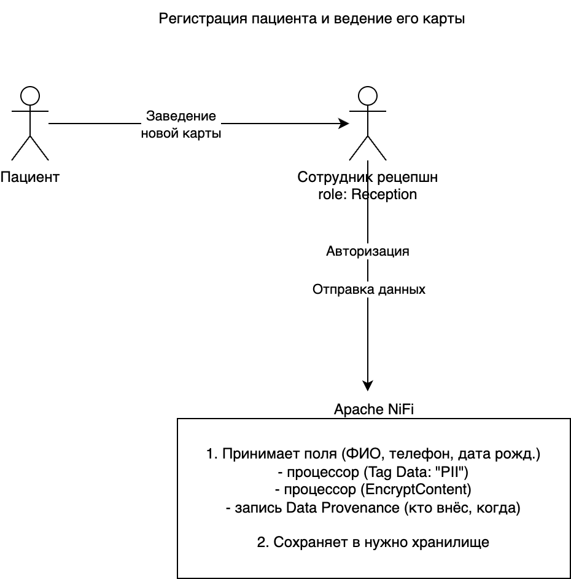
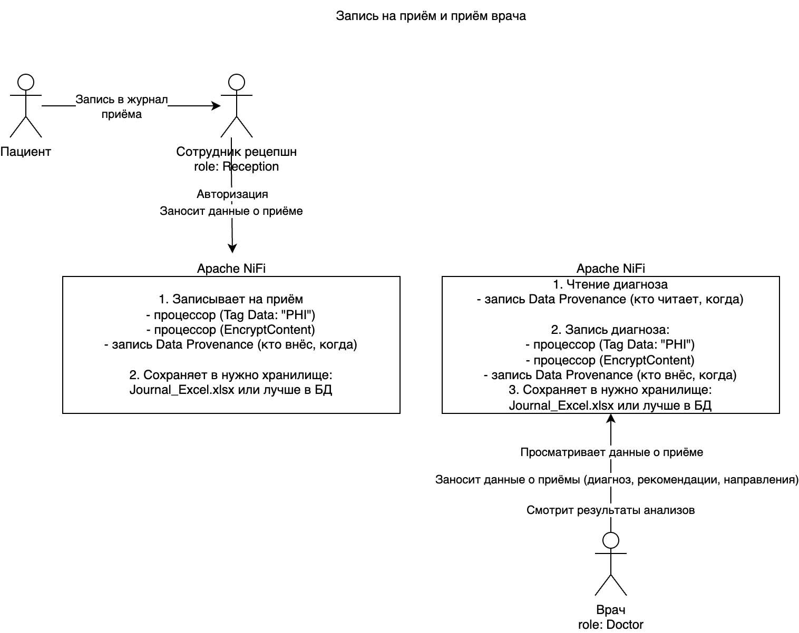
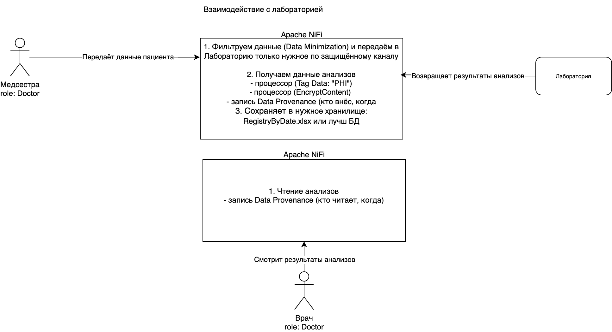

## Список данных для защиты + способы

### ФИО, телефон, e-mail, адрес (PII):

-   Шифрование на уровне БД/файлов
-   Контроль доступа (RBAC/ABAC) – доступ есть только у тех ролей, которым это нужно (администратор, врач, бухгалтер – в ограниченном объёме)

### Диагнозы, результаты анализов (PHI):

-   Шифрование и хранение в отдельном защищённом сегменте/базе
-   Тегирование (например, PHI, Confidential)
-   Логирование всех обращений к этим данным

### Финансовые данные (платежи, кассы):

-   Шифрование или хотя бы шифрованная передача
-   Ограничение доступа для бухгалтерии/кассиров
-   В 1С реализовать более строгие права, чтобы не все сотрудники видели все поля

## Механизм тегирования данных

### Категории тегов:

-   PII (имя, телефон, почта и др.)
-   PHI (диагнозы, анализы)
-   Financial (платежи, счета)
-   Internal (служебная инфо)
-   Public (расценки, расписание, контакты)

### Использование тегов:

-   Автоматическая проверка при загрузке новых файлов

    или

-   Проверка полей в БД/CRM (при появлении новой записи автоматически присваивать тег, если она содержит признаки «медицинских» или «личных» данных)

-   Связка тегов с политикой доступа: у ролей есть права только на некоторые теги

## Список инструментов, которые помогут

-   Apache NiFi

## Доработанные диаграммы

