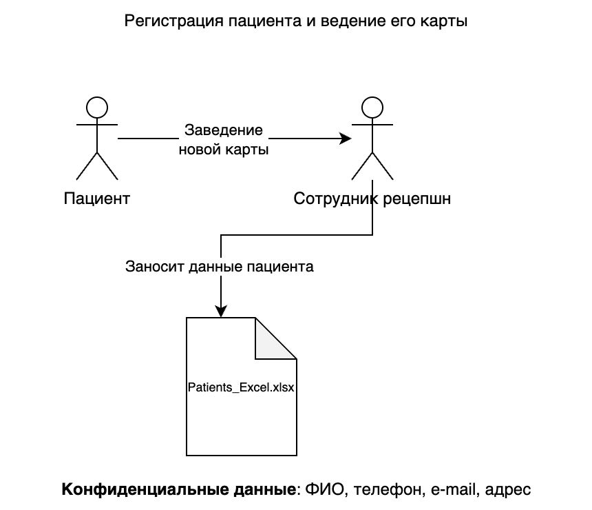
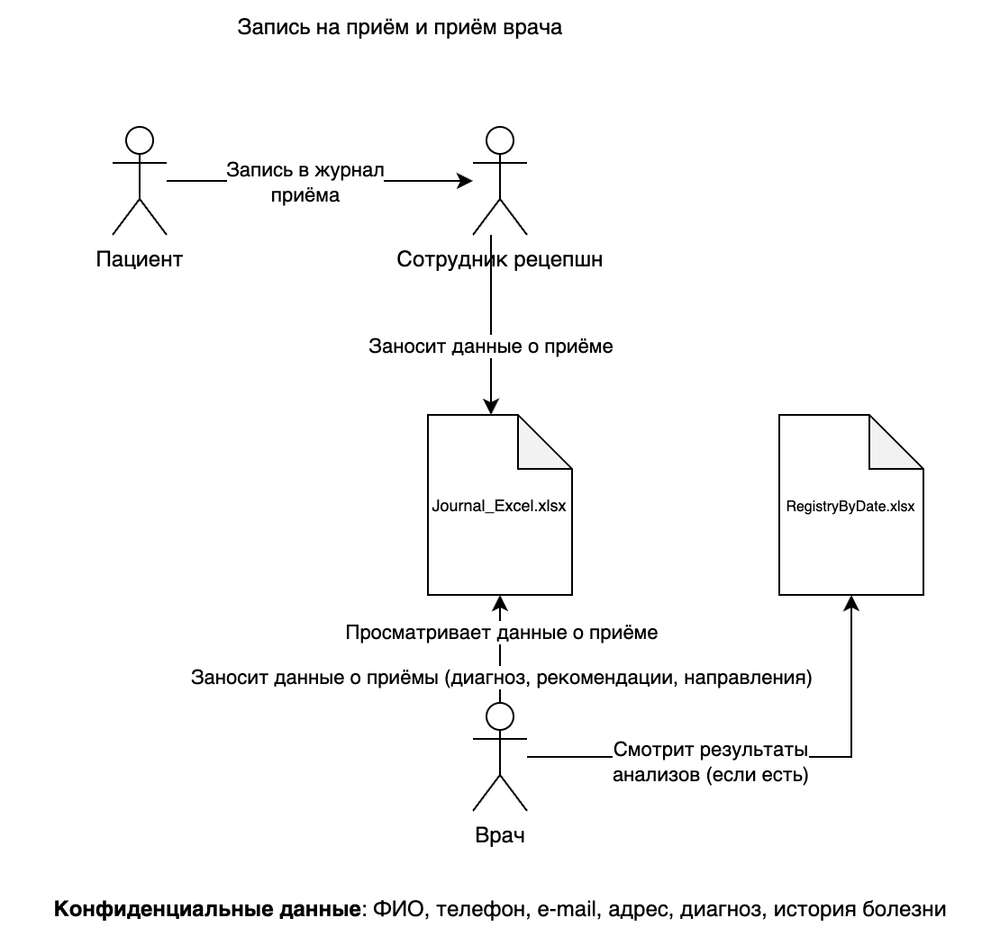
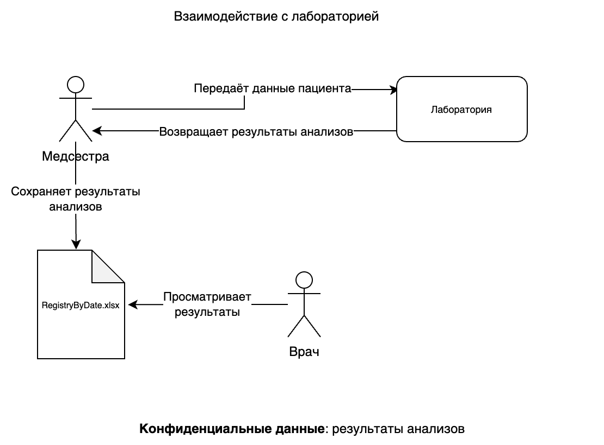
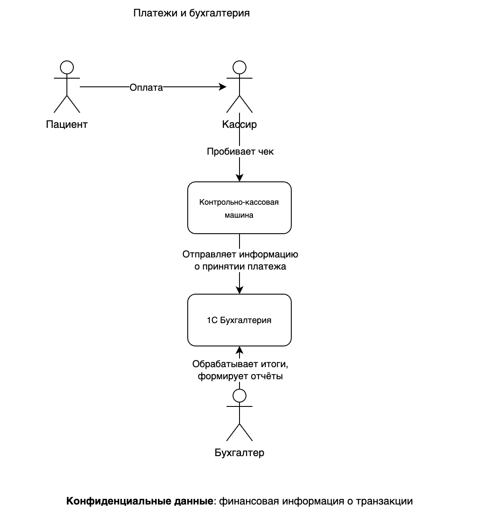
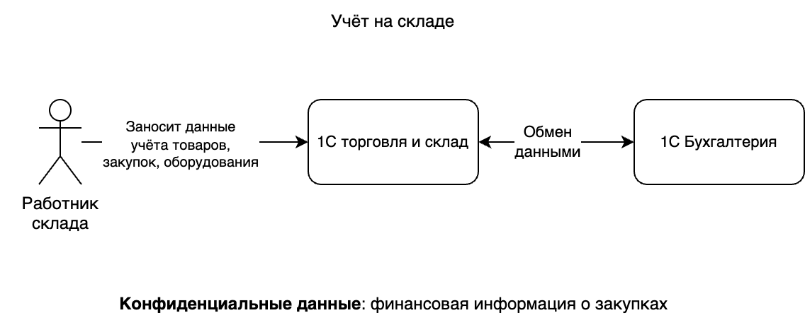

# Текущие проблемы

## Отсутствие централизованного хранилища

Данные хранятся в разных Excel-файлах. Это затрудняет аудит и контроль доступа

## Нет формальной системы доступов

Сейчас доступ к Excel-файлам часто общий: любой сотрудник с правами на сетевую папку может просматривать/редактировать конфиденциальные данные

## Нет шифрования на уровне файлов или дисков

Файлы хранятся в открытом виде. При физическом доступе или утечке учётных данных в домене нападающий получит доступ к ко всем данным

## Нет журнала действий (аудита)

Изменения в Excel не отслеживаются (кто открыл, скачал, удалил, внёс новые данные), невозможно отследить злонамеренные действия

## Взаимодействие с лабораторией

Данные пациента отправляются и возвращаются по почте или через незашифрованные каналы

## Отсутствие тегирования и классификации

Сотрудники не разделяют, какие файлы содержат PHI/PII, а какие – обычную служебную информацию. Непонятно, как именно ограничить доступ и как автоматизировать защиту

## Человеческий фактор

Большая часть процессов проходит на доверии (сотрудники вручную передают файлы и могут сделать копии на личные флешки или облако)

# Текущие Data Flow Diagrams

